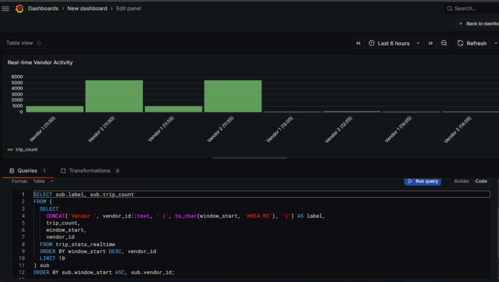
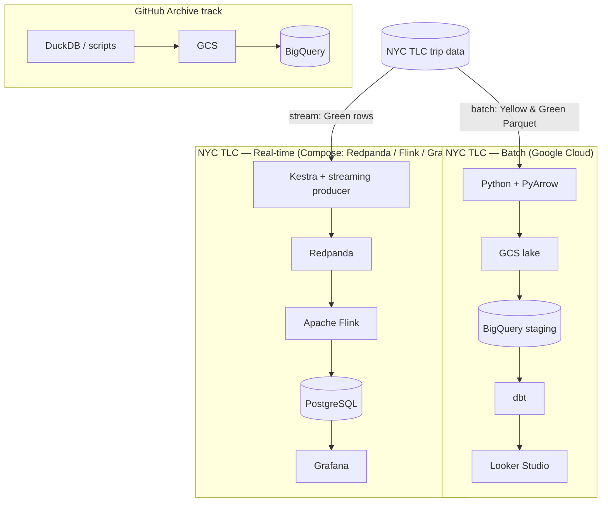

# Data Engineering Portfolio (GitHub Archive + NYC TLC Taxi)

End-to-end analytics on **GCP** (lake → **BigQuery** → **dbt** → **Looker Studio**), plus optional **GitHub Archive** ingestion and a **local** streaming demo (Redpanda → Flink → Postgres → **Grafana**).

**Skim path:** [Quick start](#quick-start) and [Project objective](#project-objective), then walk the [NYC TLC batch](#end-to-end-workflow-execution-order) in order. [GitHub Archive](#optional-github-archive-track), [streaming](#realtime-streaming-green-flink-postgres), and [tests / CI](#going-the-extra-mile-optional) sit outside that spine on purpose.

---

## Table of contents

| Read first | Sections |
|------------|----------|
| **Onboarding** | [Quick start](#quick-start) · [Prerequisites](#prerequisites) · [Repository root](#repository-root-for-commands) · [Repository layout](#repository-layout-where-things-live) |
| **Main batch (NYC TLC)** — follow in order | [Project objective](#project-objective) · [End-to-end workflow](#end-to-end-workflow-execution-order) · [Terraform](#terraform) · [Ingest (NYC TLC)](#ingest-nyc-tlc) · [dbt data modeling](#dbt-data-modeling-layered-structure) · [Data validation](#data-validation-bigquery-sql) · [Looker Studio dashboard](#looker-studio-dashboard-nyc-tlc) · [Configuration (GCP and Kestra)](#configuration-gcp-and-kestra) |
| **Optional tracks** | [GitHub Archive track](#optional-github-archive-track) · [Real-time streaming](#realtime-streaming-green-flink-postgres) · [Going the extra mile](#going-the-extra-mile-optional) |
| **Deep dive** | [Story at a glance](#story-at-a-glance-nyc-tlc-track) · [Tech stack](#tech-stack) · [Architecture](#architecture-high-level) · [Current scope](#current-scope-this-repo) |
| **Support & meta** | [Troubleshooting and FAQ](#troubleshooting-and-faq) · [Standalone repository & GitHub](#standalone-repository--github) · [What this repo is meant to show](#what-this-repo-is-meant-to-show) |

---

## Quick start

Below is the **NYC taxi batch** path I documented end to end (Parquet → GCS → BigQuery → dbt → Looker). **Never commit** secrets (`credentials/gcp-service-account.json`, **`credentials/local-dev-ui.env`**, raw keys in Kestra KV). For **Kestra / Grafana** defaults, copy **`credentials/local-dev-ui.env.example`** → **`credentials/local-dev-ui.env`** — details in **`credentials/README.md`**.

1. **Clone** and `cd` to the repo root (this folder — where this `README.md` lives).
2. **Local setup after clone:** credentials, Python, dbt profiles — **[`docs/POST_CLONE_SETUP.md`](docs/POST_CLONE_SETUP.md)**.
3. **Install Python deps** (from the repo root): `pip install -r requirements.txt` (ingest script deps are pulled via [`requirements-ingest.txt`](requirements-ingest.txt) as referenced in `requirements.txt`).
4. **GCP:** project with **BigQuery** + **GCS**; **service account** JSON with roles for Terraform, GCS, and BigQuery. Default path: **`credentials/gcp-service-account.json`** (see **`credentials/README.md`**) or set **`GCP_CREDS_PATH`**.
5. **Environment variables** for ingest/upload — set at least `GCP_PROJECT_ID`, `GCS_BUCKET`, and optionally `BQ_DATASET` (default `trips_data_all`). Full table: [Environment variables](#environment-variables-python-upload--ingest).
6. **Infrastructure:** `cd terraform && terraform init && terraform plan && terraform apply` — details: [Terraform](#terraform).
7. **Ingest TLC data:** `python scripts/ingest_tlc_2019_2020.py` (network + GCP required). Scope: **2019-01 … 2020-12** Yellow/Green — [Ingest (NYC TLC)](#ingest-nyc-tlc).
8. **Transform:** `cd nyc_taxi_dbt && dbt seed && dbt run` — `profiles.yml` must point at **your** project and dataset — [dbt](#dbt-data-modeling-layered-structure).
9. **Dashboard:** connect **Looker Studio** to your **mart** tables — [Looker Studio dashboard](#looker-studio-dashboard-nyc-tlc).

**Outside this path:** **GitHub Archive** ingestion, **Kestra-orchestrated** batch (alternative to the Python script), **streaming** (Flink/Grafana), and **tests/CI** — see [Optional tracks](#optional-github-archive-track) and [Going the extra mile](#going-the-extra-mile-optional).

**Shortcuts:** root **`Makefile`** — `make help` (GNU Make: Git Bash / WSL / macOS / Linux). See [Going the extra mile](#going-the-extra-mile-optional).

---

## Prerequisites

- **Python** 3.10+ (3.12–3.13 work well with these scripts)
- **GCP:** project with **BigQuery** + **GCS**; **service account** JSON (see Terraform / GCP docs for roles)
- **Docker Desktop** (or compatible engine + Compose) — **only if** you run **Kestra** (and streaming stack) locally via **`docker-compose.yml`** (flows that call `docker run` need the socket + custom image — [Kestra: Docker Compose](#kestra-docker-compose-local-ui))
- **Tools** (install as needed): `gcloud` CLI (optional), **dbt** with BigQuery adapter, **Terraform**, **Kestra** (flows under `kestra/flows/`), `pip` deps for `scripts/` and the dbt project

---

## Repository root for commands

Use **this folder**—the directory that contains this `README.md`—as the working directory for Terraform, dbt, and Python. In a normal clone, that is the **repository root**. If this tree lives inside a **larger parent repository**, still `cd` into **this project folder** before running any command in this document. See also [Standalone repository & GitHub](#standalone-repository--github).

---

## Repository layout (where things live)

| Location | Purpose |
|----------|---------|
| **`credentials/`** | **Local only:** **`gcp-service-account.json`** (GCP), **`local-dev-ui.env`** (Kestra/Grafana reminders — copy from **`local-dev-ui.env.example`**). Both gitignored; see **`credentials/README.md`**. |
| **`terraform/`** | GCP infrastructure (IaC); default `var.credentials` points at **`../credentials/gcp-service-account.json`** when you run Terraform from **`terraform/`** |
| **`scripts/`** | TLC ingest, GCS upload helpers, DuckDB → NDJSON export, **`upload_to_gcp.py`** (GitHub sample) |
| **`scripts/streaming/`** | **`producer.py`** — Green taxi Parquet → Kafka/Redpanda (used by [streaming flow](#realtime-streaming-green-flink-postgres)) |
| **`data/github/`** | GitHub Archive demo artifacts: **`github_test.duckdb`**, **`github_events_100.json`** (from dlt + export; see [Optional: GitHub Archive](#optional-github-archive-track)) |
| **`data/raw/nyc_taxi/`** | TLC Parquet downloads (large; not committed) |
| **`nyc_taxi_dbt/`** | dbt project (staging → core → mart) |
| **`kestra/flows/batch/`**, **`kestra/flows/stream/`** | Orchestration YAML |
| **`docs/`** | Diagrams, Looker exports, **`DOCKER_TROUBLESHOOT.md`**, [`POST_CLONE_SETUP.md`](docs/POST_CLONE_SETUP.md) |
| **`dlt/`** | dlt pipeline for GitHub Archive → DuckDB |

Unless a script’s docstring says otherwise, run commands from the **repository root**.

---

## Project objective

The work here is **end-to-end data pipelines on Google Cloud** on **one stack**, with two related storylines:

| Track | Focus | Outcome |
|-------|--------|---------|
| **GitHub Archive** | **Ingestion & orchestration** (lake → warehouse): DuckDB-based extraction, **GCS**, **Kestra**-driven loads into **BigQuery** where partitioning matches the load | Emphasis on **orchestration** and lake-to-warehouse mechanics |
| **NYC TLC Taxi (Yellow & Green)** | **Batch** Parquet through `scripts/ingest_tlc_2019_2020.py`, **BigQuery**, **dbt** **staging → core → mart**, **Looker Studio** on marts | Emphasis on **modeling**, marts, and BI |

[GitHub Archive](https://www.gharchive.org/) ships hourly public JSON; I keep a **small sample** (`github_events_100`) so the cloud path stays cheap to replay, not a full crawl.

Together the paths read **lake → warehouse → transformation → dashboard**. **Looker exports (PDF / PNG):** [`docs/nyc-taxi-looker-analytics/`](docs/nyc-taxi-looker-analytics/README.md).

---

## End-to-end workflow (execution order)

| Step | What | How (summary) |
|------|------|----------------|
| 1. Infra | GCS bucket, BigQuery datasets, IAM | `terraform init` → `plan` → `apply` — [Terraform](#terraform), [Configuration](#configuration-gcp-and-kestra) |
| 2. Orchestration (GitHub path) | GCS → BigQuery | Kestra flows after KV is set — [Optional: GitHub Archive](#optional-github-archive-track) |
| 2b. NYC TLC pipeline (main batch path for taxi) | Parquet → merge → GCS → BigQuery | `python scripts/ingest_tlc_2019_2020.py` — **Alternative:** `kestra/flows/batch/nyc_taxi_ingest_pipeline.yaml` or split flows — [Kestra: Docker Compose](#kestra-docker-compose-local-ui), [Ingest](#ingest-nyc-tlc) |
| 3. Transformation | dbt | `cd nyc_taxi_dbt` → `dbt seed` → `dbt run` |
| 4. BI | Looker Studio | BigQuery connector → **your** project + **dbt** dataset from `profiles.yml` — [Looker](#looker-studio-dashboard-nyc-tlc) |
| 5. (Optional) Real-time | Redpanda → Flink → Postgres → Grafana | [Real-time streaming](#realtime-streaming-green-flink-postgres) |

**Batch orchestration (Kestra vs. Python script):** I document the TLC path with one **Python entrypoint** for easy replay. The **same pipeline** also exists under `kestra/flows/batch/` — e.g. **`nyc_taxi_ingest_pipeline.yaml`** (sequential stages), plus split flows (`nyc_taxi_to_gcs_optimized.yaml`, `gcs_to_bigquery.yaml`, `gcs_to_bigquery_green.yaml`). Pick **either** the script or Kestra depending on whether you prefer a single command or orchestrated tasks.

---

## Terraform

From a machine with credentials — **do not commit** JSON keys:

```bash
cd terraform
terraform init
terraform plan
terraform apply
```

Defaults in `terraform/variables.tf` are **placeholders** (`your-gcp-project-id`, `your-gcs-bucket-name`); override with **`terraform.tfvars`** (gitignored) or `-var` flags before a real `apply`. Renaming the bucket may **create** a new bucket; clean up old resources if needed.

---

## Ingest (NYC TLC)

**Script:** `scripts/ingest_tlc_2019_2020.py` — download monthly **Yellow/Green** Parquet (TLC), merge with **PyArrow**, upload to **GCS**, **LOAD** into BigQuery (default dataset **`trips_data_all`**; override with **`BQ_DATASET`**).

**Official patterns:** `https://d37ci6vzurychx.cloudfront.net/trip-data/yellow_tripdata_YYYY-MM.parquet` (and green).

**BigQuery output tables (typical):** `yellow_tripdata_2019_2020`, `green_tripdata_2019_2020` in dataset **`trips_data_all`** (see script docstring).

**After load:** `cd nyc_taxi_dbt && dbt seed && dbt run`.

**Environment:** `GCP_PROJECT_ID`, `GCS_BUCKET`, `BQ_DATASET`, `GCP_CREDS_PATH` — [Environment variables](#environment-variables-python-upload--ingest).

### TLC ingest scope: why 2019–2020?

The batch script loads **2019-01 through 2020-12** (`scripts/ingest_tlc_2019_2020.py`).

- **Primary:** Reproducible public monthly files; **two full calendar years** for YoY and **COVID-19** effects in **2020**
- **Secondary:** Smaller download / merge / load than full history — keeps the demo bounded and fast to rerun

---

## dbt data modeling (layered structure)

The dbt project is **`nyc_taxi_dbt/`** (NYC Yellow & Green taxi analytics). It follows **staging → core → mart**.

| Layer | Role | Models (examples) |
|-------|------|-------------------|
| **Staging** | Casts, cleaning, surrogate keys | `stg_yellow_tripdata`, `stg_green_tripdata` |
| **Core** | Dimensions & facts | `dim_zones`, `fact_trips` |
| **Mart** | Pre-aggregated metrics | `dm_monthly_zone_revenue`, `dm_citywide_monthly`, `dm_service_type_totals` |

**Mart note:** `dm_monthly_zone_revenue` is materialized as a **table** for efficient queries by zone / month / service type.

### BigQuery optimization (partitioning, clustering, marts)

| Layer | What we do | Why |
|-------|----------------|-----|
| **Raw trip tables** (from `scripts/ingest_tlc_2019_2020.py`) | **Daily** time partitioning on **`tpep_pickup_datetime`** (Yellow) and **`lpep_pickup_datetime`** (Green); **clustering** on **`VendorID`**, **`PULocationID`** | Time filters prune partitions; vendor/zone predicates align with clustering (`TimePartitioning` + `clustering_fields`) |
| **Alternative path** | `kestra/flows/batch/gcs_to_bigquery.yaml`, `gcs_to_bigquery_green.yaml` | Partitioned + clustered tables from GCS via SQL — orchestrated in Kestra |
| **dbt marts** | `core/` and `mart/` materialized as **tables** where needed (`dbt_project.yml`) | Pre-aggregated grains for **Looker Studio** |

Confirm layout in BigQuery UI (**Table details**) or `INFORMATION_SCHEMA`.

```text
nyc_taxi_dbt/
  models/
    stg_yellow_tripdata.sql
    stg_green_tripdata.sql
    core/
      dim_zones.sql
      fact_trips.sql
    mart/
      dm_monthly_zone_revenue.sql
      dm_citywide_monthly.sql
      dm_service_type_totals.sql
  seeds/
    taxi_zone_lookup.csv
```

Point `profiles.yml` at **your** GCP project and dataset before running dbt.

---

## Data validation (BigQuery SQL)

Mart logic should be verified in **BigQuery** (grain, `SUM` across zones). **Looker** is a visual check on top of the same tables.

**Grain:** `dm_monthly_zone_revenue` has one row per **(pickup zone × calendar month × service type)**. City-wide totals require **`SUM(...) GROUP BY revenue_month, service_type`**.

Replace `` `YOUR_GCP_PROJECT` `` and `` `YOUR_DATASET` `` with values from **`profiles.yml`**.

**Fully qualified example:** `` `YOUR_GCP_PROJECT.YOUR_DATASET.dm_monthly_zone_revenue` ``

### 1. Monthly trip totals (city-wide roll-up)

```sql
SELECT
  revenue_month,
  service_type,
  SUM(total_monthly_trips) AS total_monthly_trips
FROM `YOUR_GCP_PROJECT.YOUR_DATASET.dm_monthly_zone_revenue`
GROUP BY revenue_month, service_type
ORDER BY revenue_month ASC, service_type DESC;
```

### 2. Top 5 zones by revenue

```sql
SELECT
  revenue_zone,
  SUM(revenue_monthly_total_amount) AS total_revenue,
  SUM(total_monthly_trips) AS total_trips
FROM `YOUR_GCP_PROJECT.YOUR_DATASET.dm_monthly_zone_revenue`
GROUP BY revenue_zone
ORDER BY total_revenue DESC
LIMIT 5;
```

---

## Looker Studio dashboard (NYC TLC)

**Layout:** at least **two tiles** — one **categorical** chart, one **time** chart, with clear titles (what I aimed for in the static exports under `docs/nyc-taxi-looker-analytics/`).

### Report content (example)

| Element | Description |
|---------|-------------|
| **Report title** | e.g. `NYC Taxi Data Pipeline Analytics (2019–2020)` |
| **Tile 1 (categorical)** | Donut / pie — `service_type` vs **`trip_total`** from **`dm_service_type_totals`**, or `SUM(total_monthly_trips)` from **`dm_monthly_zone_revenue`** with correct aggregation |
| **Tile 2 (temporal)** | Stacked bar — month on X-axis, year (2019 vs 2020) as breakdown; **`dm_citywide_monthly.trips`** or related |
| **Filters** | Date range on `revenue_month` (2019-01-01 — 2020-12-31); optional `service_type` |

**Storyline:** Compare **2019 vs 2020** for **YoY** and **COVID-19** impacts. Layout: **donut** (share by `service_type`) + **stacked bar** (months × year).

**Note:** If Looker errors on `SUM` for pre-aggregated fields, use **`dm_service_type_totals`** for the pie and **`dm_citywide_monthly`** for time series, or `EXTRACT(MONTH/YEAR FROM revenue_month)`.

### Dashboard artifacts (exported)

| File | Description |
|------|-------------|
| `NYC_Taxi_Data_Pipeline_Analytics_(2019–2020).pdf` | PDF export |
| `NYC_Taxi_Data_Pipeline_Analytics_(2019–2020).png` | PNG |

Location: **`docs/nyc-taxi-looker-analytics/`** — see [`docs/nyc-taxi-looker-analytics/README.md`](docs/nyc-taxi-looker-analytics/README.md).

---

## Configuration (GCP and Kestra)

> **Public repos:** Use **your own** project id, bucket, and dataset names. Do **not** commit service account JSON.

### GCS bucket

- Set a **globally unique** bucket name in **Terraform**, **upload scripts**, and **Kestra KV** (`GCP_BUCKET`) so all three match.
- In docs, substitute **`YOUR_GCS_BUCKET`** for your real name.

### Environment variables (Python upload / ingest)

Scripts default to README placeholders (`YOUR_GCP_PROJECT`, `YOUR_GCS_BUCKET`). Set these when you run locally or in CI:

| Variable | Scripts | Purpose |
|----------|---------|---------|
| `GCP_PROJECT_ID` | `scripts/ingest_tlc_2019_2020.py`, `scripts/upload_to_gcp.py` | GCP project id |
| `GCS_BUCKET` | `scripts/ingest_tlc_2019_2020.py`, `scripts/upload_to_gcp.py`, `scripts/upload_green_parquet_to_gcs.py` | Lake bucket (matches Terraform + Kestra KV) |
| `BQ_DATASET` | `scripts/ingest_tlc_2019_2020.py` | BigQuery dataset for TLC tables (default `trips_data_all`) |
| `BQ_DATASET_GITHUB`, `BQ_TABLE_GITHUB_EVENTS` | `scripts/upload_to_gcp.py` | GitHub Archive dataset / table (defaults: `github_archive_data`, `github_events_100`) |
| `GCP_CREDS_PATH` | ingest / upload helpers | Service account JSON path (default: **`credentials/gcp-service-account.json`**) |

### Kestra KV (namespace `system`)

**Kestra UI → Namespaces → system → KV**

| Key | Value |
|-----|--------|
| `GCP_BUCKET` | **`YOUR_GCS_BUCKET`** (no leading/trailing spaces) |
| `GCP_CREDS` | Full JSON of the service account for GCS/BigQuery — **never commit** |

Flows use `{{ kv('GCP_BUCKET') }}` and `{{ kv('GCP_CREDS') }}`; values are **not** in the repo.

**REST API (optional):** `/api/v1/main/namespaces/<namespace>/kv/<key>`. Many builds expect **`Content-Type: text/plain`**. For **`GCP_BUCKET`** with **hyphens**, send a **JSON string** body (e.g. `"my-project-bucket"`). **`GCP_CREDS`**: PUT **raw JSON** as `text/plain`. Use Basic Auth if enabled.

### Kestra: Docker Compose (local UI)

Run from the **repository root**.

| Item | Detail |
|------|--------|
| **Compose file** | `docker-compose.yml` — **Kestra** + **PostgreSQL** + **Redpanda** + **Flink** + **Grafana** |
| **Custom image** | `Dockerfile.kestra` — **`docker` CLI** inside the image for flows that call `docker run` |
| **Repo mount** | Project at **`/workspace`** inside Kestra |
| **Credentials** | `./credentials/gcp-service-account.json` → `/app/gcp-service-account.json` in Kestra; **`GOOGLE_APPLICATION_CREDENTIALS`** set in Compose — **do not commit** the JSON |
| **Ports (host)** | **Kestra** [http://localhost:8090](http://localhost:8090); **Flink** [http://localhost:9081](http://localhost:9081); **Redpanda** **9092** / **29092** (Docker network); **Grafana** [http://localhost:3000](http://localhost:3000) |
| **Web UI auth** | Kestra: `admin@company.com` / `StrongPass1` (defaults in compose). Grafana: **`admin` / `admin`** |
| **First-time / Dockerfile changes** | `docker compose build kestra` then `docker compose up -d` |

**Flow `nyc_taxi_ingest_pipeline` (TLC batch):**

1. **Register** the YAML (UI or [Kestra API](https://kestra.io/docs/how-to-guides/api)).
2. Set **`variables.workspace_host`** in `kestra/flows/batch/nyc_taxi_ingest_pipeline.yaml` to the **absolute host path** of this repo (Windows Docker: forward slashes, e.g. `E:/path/to/nyc-taxi-pipeline-analytics`). Nested `docker run -v` uses the **host** path.
3. KV keys **`GCP_BUCKET`** and **`GCP_CREDS`** (namespace **`system`**).
4. **Execute** with narrow inputs first (e.g. `start` = `end` = `2020-12`). Defaults: **2019-01**–**2020-12**.

**Important:** Ingest merge logic may consider **all** Parquet under `data/raw/nyc_taxi/` — for a **one-month** test, use a clean `data/raw` tree or only intended months.

**Runtime:** `tlc_upload` / `tlc_bigquery` can run **many minutes**; a nested `python:3.12-slim` container for **tens of minutes** is often **normal**.

**After SUCCESS:** Confirm **`tlc_download` → `tlc_upload` → `tlc_bigquery`** in Kestra; verify **BigQuery** dataset (default **`trips_data_all`**); then **dbt** (`cd nyc_taxi_dbt` → `dbt seed` / `dbt run`).

### Security

- Do **not** commit `credentials/gcp-service-account.json`, `credentials/local-dev-ui.env`, `.env`, or other secret JSON.
- Use `.gitignore`; prefer **Kestra KV** or **Secret Manager** in production.

---

## Optional: GitHub Archive track

**Path (scripts):** `dlt/github_archive_ingestion.py` → **`data/github/github_test.duckdb`**; `scripts/export_duckdb_to_json.py` → **`data/github/github_events_100.json`**; `scripts/upload_to_gcp.py` → GCS/BigQuery.

1. **Extract** — [GitHub Archive](https://www.gharchive.org/) hourly JSON into **DuckDB** (via **dlt**), export sample **NDJSON**.
2. **Load (GCS)** — Lake bucket.
3. **Load (BigQuery)** — `scripts/upload_to_gcp.py`; **Kestra** flows in `kestra/flows/batch/` can build **partitioned** tables.
4. **Transform / consume** — dbt where defined; BigQuery SQL.

> **`github_events_100`:** **100 rows** from one hourly file — **demo scale**, not a full crawl.

---

<h2 id="realtime-streaming-green-flink-postgres">Optional: Real-time streaming (Green → Redpanda → Flink → Postgres → Grafana)</h2>

**Local Docker Compose only** — does **not** replace **BigQuery + dbt + Looker**. **Looker** = **2019 vs 2020** narrative on **marts**; **Grafana** = **near–real-time** **`trip_stats_realtime`** (ops-style).

| Piece | Where / notes |
|-------|---------------|
| **Broker** | **Redpanda** — Docker: **`redpanda:29092`**; host: **`localhost:9092`** |
| **Orchestration** | **`nyc_taxi_realtime_ingest`** (`kestra/flows/stream/nyc_taxi_realtime_ingest.yaml`): **`scripts/streaming/producer.py`** via nested Docker; **`variables.workspace_host`**; **`kafka_bootstrap`** default **`redpanda:29092`** |
| **Flink** | **`flink-jobmanager`** / **`flink-taskmanager`**; copy SQL under `scripts/sql/` into the container, then e.g. `docker compose exec -T flink-jobmanager /opt/flink/bin/sql-client.sh embedded -f /tmp/….sql` |
| **JDBC** | **`flink-connector-jdbc`** (Flink **1.18**) + PostgreSQL JDBC in **`flink-libs/`** (gitignored). Helper: **`scripts/download_flink_jdbc_jars.ps1`**. Restart Flink after adding JARs |
| **Postgres sink** | DB **`kestra`**, user **`kestra`**, password **`k3str4`**. Table **`trip_stats_realtime`**: **`scripts/sql/postgres_trip_stats_realtime.sql`** |
| **Flink SQL** | **`scripts/sql/flink_green_taxi_topic_to_pg.sql`** — topic **`taxi-topic`**, **5-minute** `TUMBLE`, sink → **`trip_stats_realtime`** |
| **Job lifecycle** | **`flink list`** → **`flink cancel <JOB_ID>`** before DDL changes |

**Quick verify:**

```bash
docker compose exec postgres psql -U kestra -d kestra -c "SELECT * FROM trip_stats_realtime ORDER BY window_start DESC LIMIT 15;"
```

**Grafana:** [http://localhost:3000](http://localhost:3000) — PostgreSQL data source: host **`postgres`**, port **5432**, database **`kestra`**, user **`kestra`**, password **`k3str4`**, TLS off.

**Bar chart (SQL example):**

```sql
SELECT sub.label, sub.trip_count
FROM (
  SELECT
    CONCAT('Vendor ', vendor_id::text, ' (', to_char(window_start, 'HH24:MI'), ')') AS label,
    trip_count,
    window_start,
    vendor_id
  FROM trip_stats_realtime
  ORDER BY window_start DESC, vendor_id
  LIMIT 10
) sub
ORDER BY sub.window_start ASC, sub.vendor_id;
```

Example panel title: **Real-time Vendor Activity**.



*Flink window aggregates in **`trip_stats_realtime`**; Grafana uses Compose Postgres.*

**Optional:** `docker logs --tail 100 <flink-taskmanager-container>`. Reference Kafka DDL: **`flink-sql/create_taxi_trips_kafka.sql`**.

---

## Going the extra mile (optional)

Beyond the core path — linting, tests, CI, and README checks that I keep green locally.

| Area | What’s in this repo |
|------|---------------------|
| **Makefile** | **`Makefile`**: `make help` — `make dbt-test`, `make dbt-all`, `make pytest`, `make lint`, `make readme-anchors`, `make docker-config`. Requires **GNU Make** (or run commands manually on Windows) |
| **dbt tests** | **`nyc_taxi_dbt/models/schema.yml`**, **`seeds/schema.yml`**, **`nyc_taxi_dbt/tests/`** — run `dbt test` (needs BigQuery + `profiles.yml`) |
| **Python unit tests** | **`tests/`** — `pip install -r requirements-dev.txt`; `pytest tests` or `make pytest` |
| **CI** | **`.github/workflows/ci.yml`** — ruff, `compileall`, pytest, README TOC anchor check (`scripts/verify_readme_anchors.py`), `docker compose config` — **no** Terraform apply or dbt against BigQuery in CI |

---

## Story at a glance (NYC TLC track)

Short version of the batch path — public trip files in, governed tables and charts out:

| Step | What happens | Tools (in this repo) |
|------|----------------|----------------------|
| 🚚 **Ingestion** | NYC TLC monthly Parquet → normalize for the cloud | Python, PyArrow (`scripts/ingest_tlc_2019_2020.py`); optional **Kestra** (`kestra/flows/`) |
| 🏠 **Lake & warehouse** | **GCS** → **BigQuery** with **partitioning** and **clustering** | GCS → BigQuery loads |
| 🍳 **Transformation** | **staging → core → mart** | **dbt** (`nyc_taxi_dbt/`) |
| 📊 **Visualization** | Marts → **Looker Studio** (e.g. **2019 vs 2020**) | Looker on mart tables |

**Pipeline (conceptual):**


*Diagram updates: [`docs/image-and-diagram-guidelines.md`](docs/image-and-diagram-guidelines.md).*

**Dashboard (static export):**

.png)

*If the image does not render, add the PNG per [`docs/nyc-taxi-looker-analytics/README.md`](docs/nyc-taxi-looker-analytics/README.md).*

---

## Tech stack

- **Cloud**: Google Cloud Platform (GCP)
- **IaC**: Terraform
- **Orchestration**: Kestra
- **Lake**: Google Cloud Storage (GCS)
- **Warehouse**: BigQuery (partitioned / clustered where applicable)
- **Batch (TLC)**: Python, **PyArrow**
- **Transformation**: dbt
- **Visualization**: Looker Studio — marts; exports: [`docs/nyc-taxi-looker-analytics/README.md`](docs/nyc-taxi-looker-analytics/README.md)
- **Streaming (local, optional)**: Redpanda, **Flink** → **PostgreSQL**, **Grafana** on **`trip_stats_realtime`** — [Real-time streaming](#realtime-streaming-green-flink-postgres)

---

## Architecture (high level)

**GitHub Archive path** — see [Optional: GitHub Archive](#optional-github-archive-track).

**NYC TLC path**

1. **Extract** — Monthly Yellow/Green Parquet (`scripts/ingest_tlc_2019_2020.py`).
2. **Transform (local)** — **PyArrow** merge → one Parquet per color.
3. **Load (GCS)** — Lake prefix.
4. **Load (BigQuery)** — `LOAD` into **`trips_data_all`** (or `BQ_DATASET`).
5. **Transform** — `nyc_taxi_dbt`: **staging → core → mart**.
6. **Visualize** — Looker Studio.

**NYC TLC — real-time (optional):** Green rows → **`taxi-topic`** → **Flink** → **`trip_stats_realtime`** → **Grafana** — [Real-time streaming](#realtime-streaming-green-flink-postgres).



---

## Current scope (this repo)

| Focus | What |
|-------|------|
| **Implemented** | GitHub **ingestion** pieces as documented; **NYC** batch ingest; **dbt** **staging → core → mart** (`dm_*` marts); **Looker Studio** (≥2 tiles) |
| **Optional / future** | Broader TLC dates, more Looker views, full **streaming** path — [Real-time streaming](#realtime-streaming-green-flink-postgres) |

---

## Troubleshooting and FAQ

| Issue | What to check |
|-------|----------------|
| **Missing GCP errors** | Service account path (`GCP_CREDS_PATH` / `credentials/gcp-service-account.json`), roles, `GCP_PROJECT_ID` / `GCS_BUCKET` |
| **Kestra flow can’t find repo** | **`variables.workspace_host`** = absolute **host** path (Windows: forward slashes) |
| **Ingest merged wrong months** | Parquet under `data/raw/nyc_taxi/` — clean folder or limit months for a narrow test |
| **Kestra task “stuck” for tens of minutes** | **`tlc_upload` / `tlc_bigquery`** are heavy — often normal; check `docker ps` for nested Python container |
| **Looker SUM on pre-aggregated field** | Use **`dm_service_type_totals`** / **`dm_citywide_monthly`** as documented — [Looker](#looker-studio-dashboard-nyc-tlc) |
| **Flink / streaming** | JARs in **`flink-libs/`**, cancel old jobs before DDL changes — [Real-time streaming](#realtime-streaming-green-flink-postgres) |
| **Clone works but commands fail** | **[`docs/POST_CLONE_SETUP.md`](docs/POST_CLONE_SETUP.md)** — tracked vs local-only files |
| **Images missing in GitHub preview** | Static assets (e.g. **`docs/nyc-taxi-looker-analytics/*.png`**) may not exist until you export from Looker — see [`docs/nyc-taxi-looker-analytics/README.md`](docs/nyc-taxi-looker-analytics/README.md) |

---

## Standalone repository & GitHub

This repository is the **clone root** (this `README.md` is at the top level). Run every Terraform, dbt, and Python command from **this directory**. If you embed the project in a **larger monorepo**, still use **this folder** as the project root for the workflows documented here.

**`git clone` only downloads tracked files.** Large Parquet under `data/raw/`, local `venv/`, dbt build output under `nyc_taxi_dbt/target/`, and secrets under `credentials/` are excluded by design (see `.gitignore`).

**Clone and continue setup:**

```bash
git clone https://github.com/YOUR_USER/YOUR_REPO.git
cd YOUR_REPO
```

Use this repository’s URL or your fork. Then follow **[`docs/POST_CLONE_SETUP.md`](docs/POST_CLONE_SETUP.md)** for service accounts and other local-only configuration.

**Optional — first-time `git push` from a fresh local folder** (e.g. you copied this tree out of a parent workspace and are creating a new remote). Initialize Git once; only tracked files are pushed:

```bash
cd /path/to/this/project
git init
git add .
git status
git commit -m "Initial commit: NYC taxi data pipeline portfolio"
git branch -M main
git remote add origin https://github.com/YOUR_USER/YOUR_REPO.git
git push -u origin main
```

---

## What this repo is meant to show

| Topic | Where to look |
|-------------|------------------------------|
| **Scope / story** | [Project objective](#project-objective): GitHub Archive + NYC TLC, lake → warehouse → dbt → Looker |
| **Cloud + IaC** | GCP (GCS, BigQuery); **Terraform** under `terraform/` |
| **Batch / orchestration** | Python ingest + **Kestra** `kestra/flows/batch/`; streaming: `kestra/flows/stream/`; **Flink** + Postgres — [Real-time streaming](#realtime-streaming-green-flink-postgres) |
| **Warehouse modeling** | BigQuery **partitioning & clustering** — [BigQuery optimization](#bigquery-optimization-partitioning-clustering-marts) |
| **Transforms** | **dbt** `nyc_taxi_dbt` |
| **Dashboards** | **Looker Studio**; exports under `docs/nyc-taxi-looker-analytics/`; optional **Grafana** on **`trip_stats_realtime`** |
| **Reproducibility** | [Quick start](#quick-start), [Configuration](#configuration-gcp-and-kestra), [`docs/POST_CLONE_SETUP.md`](docs/POST_CLONE_SETUP.md); [Going the extra mile](#going-the-extra-mile-optional) for CI and tests |
