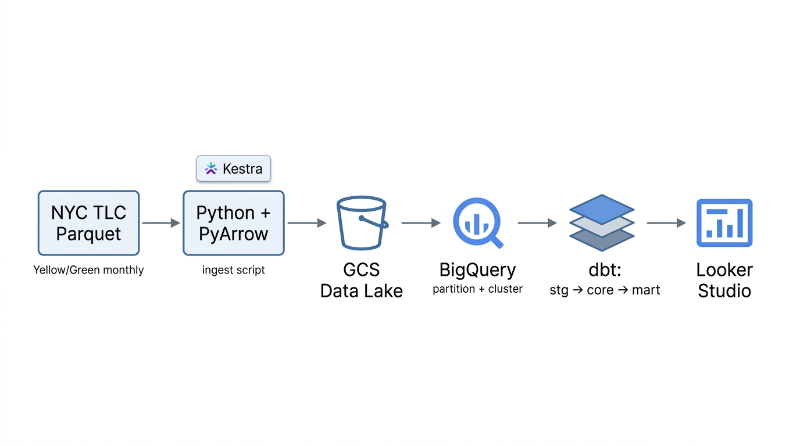
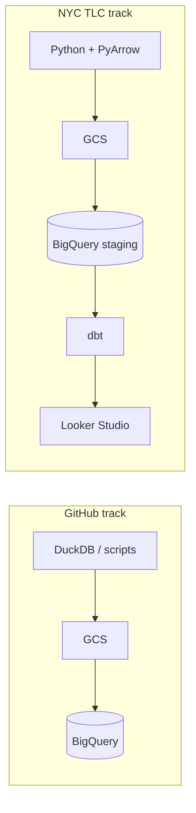

# Data Engineering Portfolio (GitHub Archive + NYC TLC Taxi)

## Story at a glance (NYC TLC track)

Think of this pipeline as a **taxi dispatch office** turning public trip records into decisions people can see:

| Step | What happens | Tools (in this repo) |
|------|----------------|----------------------|
| 🚚 **Ingestion** | NYC TLC publishes monthly Parquet; we **bring it in** and normalize it for the cloud. | Python, PyArrow (`scripts/ingest_tlc_2019_2020.py`); optional **Kestra** (`kestra/flows/`) |
| 🏠 **Lake & warehouse** | Files land in **GCS** (lake), then load into **BigQuery** with **partitioning** and **clustering** so time- and vendor-heavy queries stay fast. | GCS → BigQuery loads |
| 🍳 **Transformation** | Raw trips become **staging → core → mart** models—monthly and service-type metrics instead of row-by-row receipts. | **dbt** (`nyc_taxi_dbt/`) |
| 📊 **Visualization** | Marts feed a **Looker Studio** report so trends (e.g. **2019 vs 2020**, COVID-era dips) are obvious without writing SQL first. | Looker Studio on mart tables |

This repository also includes a **GitHub Archive** ingestion track on the same GCP stack (orchestration + lake → BigQuery); see [Project objective](#project-objective) and [Architecture (high level)](#architecture-high-level).

**Pipeline (conceptual)** — NYC TLC batch path (Parquet → GCS → BigQuery → dbt → Looker):



*When updating diagrams or hero images, keep facts and style consistent with [`docs/image-and-diagram-guidelines.md`](docs/image-and-diagram-guidelines.md).*

**Dashboard (static export)** — pre-aggregated marts as a single screen:

.png)

*If the image does not render locally, add the PNG next to [`docs/nyc-taxi-looker-analytics/README.md`](docs/nyc-taxi-looker-analytics/README.md) or open that folder after export.*

---

## Project objective

This repository demonstrates **end-to-end data pipelines on Google Cloud** across **two complementary domains** on the **same GCP stack**:

| Track | Focus | Outcome |
|-------|--------|---------|
| **GitHub Archive** | **Ingestion & orchestration** (lake → warehouse patterns): DuckDB-based extraction, **GCS** as the data lake, **Kestra**-orchestrated loads into **BigQuery**, partitioning where the load defines it, and cloud-native patterns. | Breadth: orchestration, lake → warehouse. |
| **NYC TLC Taxi (Yellow & Green)** | **Batch** ingestion of TLC Parquet (see `scripts/ingest_tlc_2019_2020.py`), **BigQuery** loads, **dbt** from **staging → core → mart**, **Looker Studio** on mart tables. | Depth: dimensional modeling, grain-aware marts, BI. |

**Why GitHub Archive (this track):** [GitHub Archive](https://www.gharchive.org/) provides **hourly public JSON event streams** (repository activity over time), which fits **time-oriented ingestion**, **lake → BigQuery** loads, and orchestration practice. This repository uses a **small, reproducible sample** (`github_events_100`)—not a full historical crawl—so cloud runs stay cheap and reviewable.

Together, these tracks show **lake → warehouse → transformation → dashboard**—a standard analytics-engineering scope (pipeline + warehouse SQL + dashboard).

**NYC TLC — Looker Studio exports (PDF / PNG):** Static copies of the dashboard are in **`docs/nyc-taxi-looker-analytics/`** — see [`docs/nyc-taxi-looker-analytics/README.md`](docs/nyc-taxi-looker-analytics/README.md) for `NYC_Taxi_Data_Pipeline_Analytics_(2019–2020).pdf` and `.png`.

> **Why two domains?** One track is **ingest/orchestration** (GitHub Archive → lake → BigQuery); the other is **modeling + BI** (NYC taxi → dbt → Looker). Showing **two subject areas** on purpose avoids a portfolio that reads as **only one business domain** (for example, taxi analytics alone). Together they make **breadth** (orchestration, lake patterns) and **depth** (dimensional models, marts) visible in one repository.

**Repository root for commands:** use **this folder** as the working directory for Terraform, dbt, and Python. For a **standalone Git clone**, that is the **clone root**. If this project is nested inside a larger parent repo, use the path to **this** directory as the root. See [Standalone repository & GitHub](#standalone-repository--github).

### Prerequisites

- **Python** 3.10+ (3.12–3.13 are commonly used and work well with these scripts)
- **GCP**: project with **BigQuery** + **GCS** enabled; **service account** JSON with appropriate roles (see Terraform / GCP docs)
- **Docker Desktop** (or another Docker engine with Compose) — **only if** you run **Kestra** locally via `docker-compose.yml` (flows that call `docker run` need the socket + custom image; see [Kestra: Docker Compose](#kestra-docker-compose-local-ui)).
- **Tools** (install as needed): `gcloud` CLI (optional), **dbt** with BigQuery adapter, **Terraform**, **Kestra** (orchestration flows in `kestra/flows/`), `pip install` deps in `scripts`/dbt project

---

## Tech stack

- **Cloud**: Google Cloud Platform (GCP)
- **Infrastructure as Code (IaC)**: Terraform
- **Workflow orchestration**: Kestra
- **Data lake**: Google Cloud Storage (GCS)
- **Data warehouse**: BigQuery (partitioned / clustered where applicable)
- **Batch processing (TLC)**: Python, **PyArrow** (Parquet merge / schema unify before BigQuery load)
- **Transformation**: dbt (Data Build Tool)
- **Visualization**: Looker Studio — reports on **dbt** mart tables ([dashboard section](#looker-studio-dashboard-nyc-tlc)); archived **PDF/PNG** exports: [`docs/nyc-taxi-looker-analytics/README.md`](docs/nyc-taxi-looker-analytics/README.md). SQL validation in BigQuery remains the primary **QA** for grain and totals.

---

## Architecture (high level)

**GitHub Archive path** (scripts in-repo: `dlt/github_archive_ingestion.py` → DuckDB; `scripts/export_duckdb_to_json.py` → NDJSON; `upload_to_gcp.py` → GCS/BigQuery)

1. **Extract** — Load [GitHub Archive](https://www.gharchive.org/) hourly JSON into **DuckDB** (via **dlt**), then export a sample to **NDJSON** for cloud load.
2. **Load (GCS)** — Land files in the **data lake** bucket.
3. **Load (BigQuery)** — Load NDJSON into BigQuery (`upload_to_gcp.py`); **partitioning** depends on the load job you use (sample path may use autodetect; **Kestra** flows in `kestra/flows/` can build **partitioned** tables explicitly).
4. **Transform** — dbt models (where this track defines them).
5. **Consume** — BigQuery SQL / downstream tools.

> **`github_events_100`:** **100 rows** from [one hourly GitHub Archive file](https://www.gharchive.org/)—**demo / test scale**, not a full archive load.

**NYC TLC path**

1. **Extract** — Download monthly **Yellow/Green** Parquet from TLC (`ingest_tlc_2019_2020.py`).
2. **Transform (local)** — Merge monthly files with **PyArrow** (schema drift / timestamp coercion) → single Parquet per color.
3. **Load (GCS)** — Upload merged Parquet to a **lake** prefix.
4. **Load (BigQuery)** — `LOAD` into the TLC dataset (default name **`trips_data_all`**; override with env **`BQ_DATASET`** in `scripts/ingest_tlc_2019_2020.py` if yours differs).
5. **Transform** — `nyc_taxi_dbt`: **staging → core → mart**.
6. **Visualize** — Looker Studio → marts in **your** dbt output dataset (see **`YOUR_DATASET`** / `profiles.yml`).



---

## Current scope (this repo)

| Status | Scope |
|--------|--------|
| **Done** | GitHub-oriented **ingestion** assets (DuckDB / GCS / Kestra / BigQuery) as documented; **NYC** batch ingest script, **dbt** (`nyc_taxi_dbt`) through **staging → core → mart**, including **`dm_monthly_zone_revenue`**, **`dm_citywide_monthly`**, **`dm_service_type_totals`**; **Looker Studio** (≥2 tiles: categorical + temporal). |
| **Optional** | Extend TLC date range, streaming, or extra charts — beyond the baseline documented here. |

---

## End-to-end workflow (execution order)

| Step | What | How (summary) |
|------|------|----------------|
| 1. Infra | GCS bucket, BigQuery datasets, IAM | `terraform init` → `plan` → `apply` (see [Configuration](#configuration-gcp-and-kestra)) |
| 2. Orchestration (GitHub path) | GCS → BigQuery | Kestra flows after KV is set |
| 2b. NYC TLC pipeline (main batch path for taxi) | Parquet → merge → GCS → BigQuery | `python scripts/ingest_tlc_2019_2020.py` (see script docstring). **Alternative:** **`kestra/flows/nyc_taxi_ingest_pipeline.yaml`** (download → upload → BigQuery as one flow) or the split flows (`nyc_taxi_to_gcs_optimized.yaml`, `gcs_to_bigquery*.yaml`)—see [Kestra: Docker Compose (local UI)](#kestra-docker-compose-local-ui). |
| 3. Transformation | dbt | `cd nyc_taxi_dbt` → `dbt seed` → `dbt run` |
| 4. BI | Looker Studio | BigQuery connector → **your** project + **dbt** dataset from `profiles.yml` |

**Batch orchestration (Kestra vs. Python script):** The TLC path is documented with a **single Python entrypoint** for reproducibility on any laptop. The **same logical pipeline** (extract → Parquet merge → GCS lake → BigQuery load with partitioning/clustering) is **also implemented as Kestra flows** under `kestra/flows/`: an **end-to-end** flow **`nyc_taxi_ingest_pipeline.yaml`** (three stages in a `Sequential` task), plus **split** flows (`nyc_taxi_to_gcs_optimized.yaml`, `gcs_to_bigquery.yaml`, `gcs_to_bigquery_green.yaml`). For expectations around **orchestrated batch loads to the data lake**, treat **either** the Kestra flows **or** the script as the automation story—the script is the all-in-one runner; Kestra is the **workflow-orchestrated** equivalent.

**Terraform** (from a machine with credentials — **do not commit** JSON keys):

```bash
cd terraform
terraform init
terraform plan
terraform apply
```

**dbt**

```bash
cd nyc_taxi_dbt
dbt seed
dbt run
```

**Looker Studio** — Add BigQuery data sources for mart tables; see [Looker Studio dashboard (NYC TLC)](#looker-studio-dashboard-nyc-tlc).

---

## Looker Studio dashboard (NYC TLC)

**Suggested dashboard baseline:** **at least two tiles**—one chart for **categorical distribution**, one for **distribution over time**, with clear titles.

### Report content (example)

| Element | Description |
|---------|-------------|
| **Report title** | e.g. `NYC Taxi Data Pipeline Analytics (2019–2020)` |
| **Tile 1 (categorical)** | Donut / pie — `service_type` vs **`trip_total`** from **`dm_service_type_totals`**, or `SUM(total_monthly_trips)` from **`dm_monthly_zone_revenue`** with correct aggregation. |
| **Tile 2 (temporal)** | Stacked bar — month on X-axis, year (e.g. 2019 vs 2020) as breakdown; **`total_monthly_trips`** (summed across zones) or **`dm_citywide_monthly.trips`**. |
| **Filters** | Date range on `revenue_month` (2019-01-01 — 2020-12-31); optional `service_type`. |

**Note:** If Looker errors on `SUM` for pre-aggregated fields, use **`dm_service_type_totals`** for the pie (`trip_total` without an extra `SUM`) and **`dm_citywide_monthly`** for time series, or calculated fields `EXTRACT(MONTH FROM revenue_month)` / `EXTRACT(YEAR FROM revenue_month)`.

### Dashboard artifacts (exported)

Static exports of the Looker report are stored under **`docs/nyc-taxi-looker-analytics/`** (see **`docs/nyc-taxi-looker-analytics/README.md`**):

| File | Description |
|------|-------------|
| `NYC_Taxi_Data_Pipeline_Analytics_(2019–2020).pdf` | PDF export of the dashboard |
| `NYC_Taxi_Data_Pipeline_Analytics_(2019–2020).png` | PNG image (screenshot or export) |

### TLC ingest scope: why 2019–2020?

The batch script loads **NYC TLC Yellow and Green** Parquet for **2019-01 through 2020-12** (`scripts/ingest_tlc_2019_2020.py`).

- **Primary:** **Reproducible** public monthly files; **two full calendar years** for YoY and seasonality, including **COVID-19** effects in **2020**.
- **Secondary:** Lower **download size**, **merge memory**, and **load** time than ingesting all historical months—sensible for a portfolio without changing the narrative.

---

## dbt data modeling (layered structure)

The dbt project is **`nyc_taxi_dbt/`** (NYC Yellow & Green taxi analytics). It follows **staging → core → mart**.

| Layer | Role | Models (examples) |
|-------|------|-------------------|
| **Staging** | Casts, cleaning, surrogate keys | `stg_yellow_tripdata`, `stg_green_tripdata` |
| **Core** | Dimensions & facts | `dim_zones`, `fact_trips` |
| **Mart** | Pre-aggregated metrics | `dm_monthly_zone_revenue`, `dm_citywide_monthly`, `dm_service_type_totals` |

**Mart note:** `dm_monthly_zone_revenue` is materialized as a **table** for efficient queries by zone / month / service type.

### BigQuery optimization (partitioning, clustering, marts)

The following summarizes how warehouse tables are tuned for typical queries, with a short **how/why** below.

| Layer | What we do | Why |
|-------|----------------|-----|
| **Raw trip tables** (from `scripts/ingest_tlc_2019_2020.py`) | **Daily** time partitioning on **`tpep_pickup_datetime`** (Yellow) and **`lpep_pickup_datetime`** (Green); **clustering** on **`VendorID`**, **`PULocationID`** | Time filters (date ranges, months) prune partitions; vendor/zone predicates align with clustering. Implemented in the load job (`TimePartitioning` + `clustering_fields`). |
| **Alternative path** | `kestra/flows/gcs_to_bigquery.yaml`, `gcs_to_bigquery_green.yaml` | Build **partitioned + clustered** tables from GCS via SQL (`CREATE OR REPLACE … AS SELECT`) — same design intent, orchestrated in Kestra. |
| **dbt marts** | `core/` and `mart/` models materialized as **tables** where needed (see `dbt_project.yml`) | Pre-aggregated **month × zone × service_type** (and related) grains for **Looker Studio** — smaller, faster scans than raw fact for dashboard tiles. |

After a successful load, you can confirm layout in BigQuery UI (**Table details** → partitioning & clustering) or query `INFORMATION_SCHEMA.TABLE_OPTIONS` / `INFORMATION_SCHEMA.COLUMNS` for the staging dataset.

```text
nyc_taxi_dbt/
  models/
    stg_yellow_tripdata.sql
    stg_green_tripdata.sql
    core/
      dim_zones.sql
      fact_trips.sql
    mart/
      dm_monthly_zone_revenue.sql
      dm_citywide_monthly.sql
      dm_service_type_totals.sql
  seeds/
    taxi_zone_lookup.csv
```

Point `profiles.yml` at **your** GCP project and dataset before running dbt.

---

## Data validation (BigQuery SQL)

Mart logic should be verified in **BigQuery** (grain, `SUM` across zones). **Looker** is a visual check on top of the same tables.

**Grain:** `dm_monthly_zone_revenue` has one row per **(pickup zone × calendar month × service type)**. City-wide totals require **`SUM(...) GROUP BY revenue_month, service_type`**.

Replace `` `YOUR_GCP_PROJECT` `` and `` `YOUR_DATASET` `` with the **project** and **dataset** from your **`profiles.yml`** (placeholders below — use whatever names you configured).

**Fully qualified example pattern:** `` `YOUR_GCP_PROJECT.YOUR_DATASET.dm_monthly_zone_revenue` ``

### 1. Monthly trip totals (city-wide roll-up)

```sql
SELECT
  revenue_month,
  service_type,
  SUM(total_monthly_trips) AS total_monthly_trips
FROM `YOUR_GCP_PROJECT.YOUR_DATASET.dm_monthly_zone_revenue`
GROUP BY revenue_month, service_type
ORDER BY revenue_month ASC, service_type DESC;
```

### 2. Top 5 zones by revenue

```sql
SELECT
  revenue_zone,
  SUM(revenue_monthly_total_amount) AS total_revenue,
  SUM(total_monthly_trips) AS total_trips
FROM `YOUR_GCP_PROJECT.YOUR_DATASET.dm_monthly_zone_revenue`
GROUP BY revenue_zone
ORDER BY total_revenue DESC
LIMIT 5;
```

---

## Configuration (GCP and Kestra)

> **Public / shared repositories:** Use **your own** project id, bucket name, and dataset names. Do **not** commit service account JSON. The keys below describe **what to configure**, not secret values.

### GCS bucket

- Set a **globally unique** bucket name in **Terraform**, any **upload scripts**, and **Kestra KV** (`GCP_BUCKET`) so all three match.
- In docs, substitute **`YOUR_GCS_BUCKET`** for your real name.

### Environment variables (Python upload / ingest)

Scripts default to README placeholders (`YOUR_GCP_PROJECT`, `YOUR_GCS_BUCKET`). Set these when you run locally or in CI:

| Variable | Scripts | Purpose |
|----------|---------|---------|
| `GCP_PROJECT_ID` | `scripts/ingest_tlc_2019_2020.py`, `upload_to_gcp.py` | GCP project id |
| `GCS_BUCKET` | `ingest_tlc_2019_2020.py`, `upload_to_gcp.py`, `scripts/upload_green_parquet_to_gcs.py` | Lake bucket (matches Terraform + Kestra KV) |
| `BQ_DATASET` | `ingest_tlc_2019_2020.py` | BigQuery dataset for TLC tables (default `trips_data_all`) |
| `BQ_DATASET_GITHUB`, `BQ_TABLE_GITHUB_EVENTS` | `upload_to_gcp.py` | GitHub Archive dataset / table id (defaults: `github_archive_data`, `github_events_100`) |
| `GCP_CREDS_PATH` | ingest / upload helpers | Service account JSON path (default: `terraform/gcp-creds.json` next to this repo root) |

### Kestra KV (namespace `system`)

**Kestra UI → Namespaces → system → KV**

| Key | Value |
|-----|--------|
| `GCP_BUCKET` | **`YOUR_GCS_BUCKET`** (no leading/trailing spaces). |
| `GCP_CREDS` | Full JSON of the service account used for GCS/BigQuery (same as the JSON you use locally for Terraform — **never commit this file**). |

Flows use `{{ kv('GCP_BUCKET') }}` and `{{ kv('GCP_CREDS') }}`; values are **not** in the repo.

**REST API (optional):** Open-source Kestra exposes KV under `/api/v1/main/namespaces/<namespace>/kv/<key>`. Many builds expect **`Content-Type: text/plain`**. For **`GCP_BUCKET`**, if the name contains **hyphens**, send a **JSON string** body (e.g. `"my-project-bucket"`) so the value is not truncated. **`GCP_CREDS`**: PUT the **raw JSON file contents** as `text/plain`. Use Basic Auth if enabled (see Docker Compose below).

### Kestra: Docker Compose (local UI)

Run the orchestrator **locally** from the **repository root** (the same folder as this README).

| Item | Detail |
|------|--------|
| **Compose file** | `docker-compose.yml` — **Kestra** + **PostgreSQL** (flows and executions persist across restarts). |
| **Custom image** | `Dockerfile.kestra` extends `kestra/kestra:latest` with the **`docker` CLI**. Mounting **`/var/run/docker.sock`** alone is not enough: flows that call `docker run` need the client binary inside the Kestra container. |
| **Repo mount** | The project is mounted at **`/workspace`** inside Kestra so flows and scripts see the same tree as on the host. |
| **Credentials file** | `./terraform/gcp-creds.json` is mounted for Kestra; keep that path valid (or adjust the compose file). **Do not commit** the JSON. |
| **Web UI** | [http://localhost:8080](http://localhost:8080) — basic-auth defaults are in `docker-compose.yml` (`admin@company.com` / `StrongPass1`). **Change these for anything beyond local dev.** |
| **First-time / after Dockerfile changes** | `docker compose build kestra` then `docker compose up -d`. |

**Flow `nyc_taxi_ingest_pipeline` (TLC batch):**

1. **Register** the YAML: paste into the UI or `PUT`/`POST` to `/api/v1/main/flows` (see [Kestra API](https://kestra.io/docs/how-to-guides/api)).
2. Set **`variables.workspace_host`** in `kestra/flows/nyc_taxi_ingest_pipeline.yaml` to the **absolute host path of this repo** (Docker Desktop on Windows: forward slashes, e.g. `E:/IT_SPACES/AI/Projects/nyc-taxi-pipeline-analytics`). Nested `docker run -v` uses the **host** path, not `/workspace` inside Kestra, so this must match where you cloned the project.
3. Ensure KV keys **`GCP_BUCKET`** and **`GCP_CREDS`** exist (namespace **`system`**).
4. **Execute** with **narrow inputs** first (e.g. `start` = `end` = `2020-12`) to limit cost and runtime. Default inputs in the flow are **2019-01**–**2020-12** (full two-year range).

**Important:** The **merge / upload** logic in `scripts/ingest_tlc_2019_2020.py` can consider **all** Parquet under `data/raw/nyc_taxi/` depending on stage. For a **true one-month** test, start with an empty or clean `data/raw` tree for that run, or only the months you intend—see script and flow comments.

**Runtime (what “slow” looks like):** `tlc_upload` and `tlc_bigquery` often run for **many minutes** each (Parquet merge, GCS upload, BigQuery `LOAD`). A nested `python:3.12-slim` container visible in `docker ps` for **tens of minutes** is **usually normal** while Kestra shows the task as `RUNNING`—not necessarily stuck.

**After SUCCESS:** In the UI, confirm **`tlc_download` → `tlc_upload` → `tlc_bigquery`** are all green. In **BigQuery**, check your TLC dataset (default **`trips_data_all`**) for the expected Yellow/Green tables. Then run **dbt** against those sources (`cd nyc_taxi_dbt` → `dbt seed` / `dbt run` as needed).

### Terraform

Same commands as in [End-to-end workflow (execution order)](#end-to-end-workflow-execution-order) (`cd terraform` → `init` / `plan` / `apply`). Defaults in `terraform/variables.tf` are **placeholders** (`your-gcp-project-id`, `your-gcs-bucket-name`); override with **`terraform.tfvars`** (gitignored) or `-var` flags before a real `apply`. Renaming the bucket may **create** a new bucket; clean up old resources if needed.

### Security

- Do **not** commit `gcp-creds.json`, `.env`, or any secret JSON.
- Use `.gitignore` for local credentials; prefer **Kestra KV** or **Secret Manager** in production.

---

## Standalone repository & GitHub

For portfolios and slow external drives (e.g. USB HDD), **publish this folder as its own GitHub repository** and use **`git clone`** instead of copying the whole tree with Explorer. **Git only transfers tracked files**—large Parquet, `venv`, `nyc_taxi_dbt/target/`, and secrets stay out of the remote by design (see `.gitignore`).

**First-time publish (from your fast internal disk, after creating an empty repo on GitHub):**

```bash
cd /path/to/this/project   # repository root
git init
git add .
git status    # verify no gcp-creds.json, .env, *.tfstate, or huge data paths are staged
git commit -m "Initial commit: NYC taxi data pipeline portfolio"
git branch -M main
git remote add origin https://github.com/YOUR_USER/YOUR_REPO.git
git push -u origin main
```

**Clone elsewhere (e.g. `E:\IT_SPACES\AI\Projects\my-repo`):**

```bash
git clone https://github.com/YOUR_USER/YOUR_REPO.git E:\IT_SPACES\AI\Projects\my-repo
cd E:\IT_SPACES\AI\Projects\my-repo
```

Then restore **local-only** files that are intentionally not in Git. Full checklist: **[`docs/POST_CLONE_SETUP.md`](docs/POST_CLONE_SETUP.md)**.

---

## Capability checklist (self-review)

| Criterion | How this repo addresses it |
|-------------|------------------------------|
| **Problem / scope** | [Project objective](#project-objective): two tracks (GitHub Archive + NYC TLC), lake → warehouse → dbt → Looker. |
| **Cloud + IaC** | GCP (GCS, BigQuery); **Terraform** under `terraform/`. |
| **Batch / orchestration** | Python ingest + **Kestra** flows (`kestra/flows/`, including **`nyc_taxi_ingest_pipeline`**); local stack: [Docker Compose](#kestra-docker-compose-local-ui); GCS as data lake. |
| **Data warehouse** | BigQuery tables with **partitioning & clustering** (see [BigQuery optimization](#bigquery-optimization-partitioning-clustering-marts) and ingest script). |
| **Transformations** | **dbt** `nyc_taxi_dbt`: staging → core → mart. |
| **Dashboard** | Looker Studio on marts; exports under `docs/nyc-taxi-looker-analytics/`. |
| **Reproducibility** | This README, env table, and [`docs/POST_CLONE_SETUP.md`](docs/POST_CLONE_SETUP.md). |
